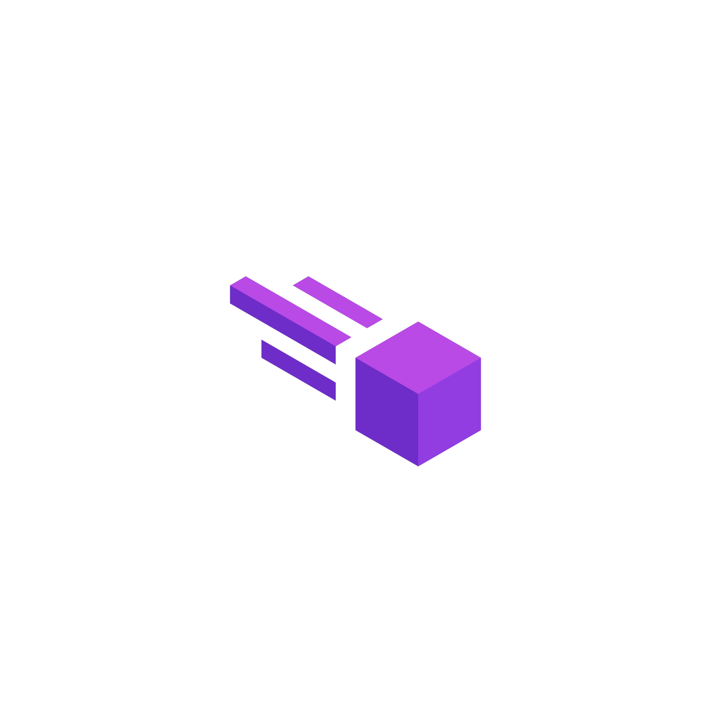

# Meteor Client



*For Roblox*

## Description

Meteor Client is a very simple UI library for Roblox. You can use this in any games! Just make sure your executor supports it.

## How To Use

To use the Meteor Client in your Roblox game, execute the following Lua code:

```lua
loadstring(game:HttpGet(""))
